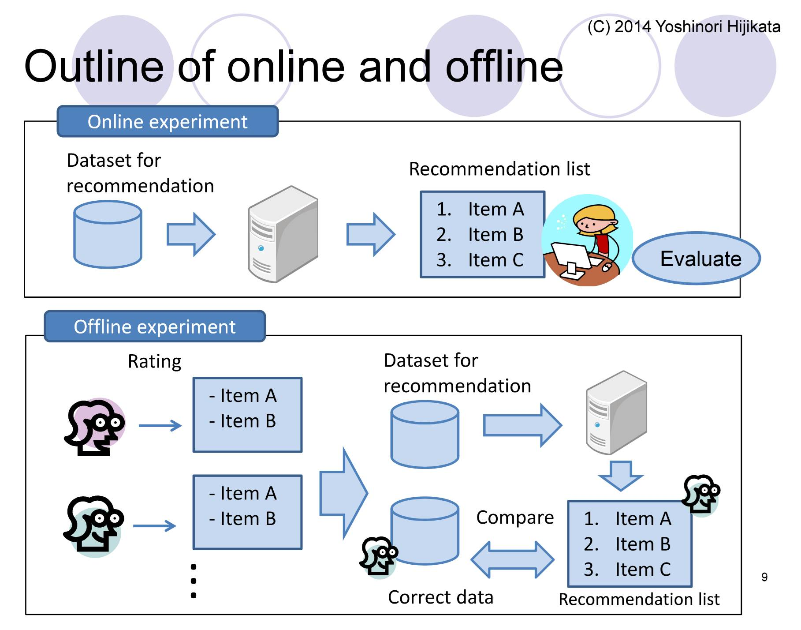

```{r setup, include=FALSE}
knitr::opts_chunk$set(echo = TRUE)
```

```{r message=FALSE,warning=FALSE}
library(dplyr)
library(ggplot2)
library(recommenderlab)
library(kableExtra)
```


#Introduction

By taking data review data from Amazon, in this project a guideline to build and evaluate a recommender system will first be presented. First a model will be designed and evaluated both on ratings and recommendations. From there the recommendations evaluation will be used to select the best out of several different models designed following the same steps as our first model. Model selection will be based on RSME. With that best model on hand, both diversity and novelty will be introduced. The effects of both on the performance metric RSME will be presented. Finally in the conclusion section a short discussion on possible online evaluation improvements will be presented.

#Data

Datasets are available on Julian McAuley's site: http://jmcauley.ucsd.edu/data/amazon/links.html

Data for instant video was selected. Data is present in rows for each user/item rating entry. The data was transformed into a user/item utility matrix and then transformed into the recommenderlab library's sparse matrix data class.

```{r}
dataRaw <- read.csv("ratings_Amazon_Instant_Video.csv", header = FALSE,colClasses=c("character","character","character","NULL"))[1:80000,]
colnames(dataRaw)<-c('user','item','rating')

numberOfUsers<-length(unique(dataRaw[["user"]]))
numberOfItems<-length(unique(dataRaw[["item"]]))
utilMatrix<-data.frame(matrix(NA, ncol = numberOfItems, nrow = numberOfUsers))
colnames(utilMatrix)<-unique(dataRaw[["item"]])
rownames(utilMatrix)<-unique(dataRaw[["user"]])
for(i in 1:nrow(dataRaw)) {
  utilMatrix[dataRaw[i,1],dataRaw[i,2]]<-dataRaw[i,3]
}
#head(utilMatrix,20) %>% kable() %>% kable_styling() %>% scroll_box(width = "800px", height = "400px")

dataAll <- as(as.matrix(utilMatrix), "realRatingMatrix")
dataAll
```

#Data Preparation

##Relevant Data

First step in data preparation was to select only users and items with 5 or more ratings. This with the objective of avoiding items and users with very low entries which do not add much information to the system. Although this might have an effect on both diversity and novelty as will be evident in that section of the project.

```{r}
data<-dataAll[rowCounts(dataAll)>5,]
data<-data[,colCounts(data)>5]
data<-data[rowCounts(data)>5,]
data
```

The heat map of the data shows the reduced set of users and items. It is also somewhat evident how each user and item have several, more than 5, ratings.

```{r}
image(data)
```

We can also observe the average ratings per user, which is important when deciding if normalization is required.

```{r}
averageRatingPerUser<-rowMeans(data)
hist(averageRatingPerUser)
```

##Normalize

As seen in the data exploration section, user ratings seem to be skewed towards the high side of the rating scale. For this reason we normalize the data before using it to build our recommender.

```{r}
dataNorm<-normalize(data)
averageRatingPerUser<-rowMeans(dataNorm)
hist(averageRatingPerUser)
```

The new heat-map shows our normalized dataset, now with continuous ratings.

```{r}
image(dataNorm)
```

We can see how now the ratings are centralized around 0.

```{r}
sum(rowMeans(dataNorm))
```

##Split Training/Test

For our recommender evaluation we do a simple split of our data selecting 80% for training and the remaining 20% for testing. Here we use the bootstrap function in recommenderlab to increase the number of cases to use. Also to note is defining what a good rating is, this will be used during one of the recommender evaluation methods.

```{r}
percentTrain<-0.8
min(rowCounts(data))
keep<-5
goodRating<-3
nEval<-1
evalSets<-evaluationScheme(data=data,method="bootstrap",train=percentTrain,given=keep,goodRating=goodRating,k=nEval)
evalSets
```

We verify the amount of data we have in our training dataset.

```{r}
getData(evalSets,"train")
```

#Initial Model

As we want to build several models and select the best performing one before experimenting with diversity and novelty, we start by going thru all the steps to design a recommender with an initial model. We start by using our training data to train an item based collaborative filtering recommender.

```{r}
model<-"IBCF"
param<-NULL
evalRecommender<-Recommender(data = getData(evalSets,"train"),method=model,parameter=param)
itemsToRecommend<-5
evalPrediction<-predict(object = evalRecommender,newdata=getData(evalSets,"known"),n=itemsToRecommend,type="ratings")
```

A histogram shows us the distribution of predicted recomendations from our first model.

```{r}
hist(rowCounts(evalPrediction))
```

#Evaluating Model

To select a model we will need a way to measure their performance, we look at two ways of measuring how good predictions from a recommender are, the first based on RMSE (Root Mean Squared Error), the second on a confusion metric and ROC and precision/recall curves.

##Evaluating the ratings

First evaluation method compares the estimated ratings with the real ones and then calculating the difference as a mean error.

```{r}
evalAccuracy<-calcPredictionAccuracy(x=evalPrediction,data=getData(evalSets,"unknown"),byUser=FALSE)
head(evalAccuracy)
```

##Evaluating the Recommendations

Another was to evaluate a recommender is to compare the recommendations from the model with actual positive ratings. Here we use our selection of good rating (defined as 3 in the data split section) as the threshold between good and bad recommendations.

```{r}
results<-evaluate(x=evalSets,method=model,n=seq(10,100,10))
getConfusionMatrix(results)[[1]]
```

The confusion matrix gives us results for all the positive and negative predictions, but we can also look at the ROC curve.We will use this curve to compare different model and select the best performing.

```{r}
plot(results,annotate=TRUE)
```

Precision or the percent of recommendation items that have been purchased, together with recall the percent of purchased items that have been recommended, are also good metrics. We can plot these results as per below.

```{r}
plot(results,"prec/rec",annotate=TRUE)
```

In general a good recommender should have balanced precession recall. A metric also often used is the F2-score, which provides a way to combine the two in a single metric.

##Selecting a Model

Now that we have a way to train a model and measure its performance, we build several model and compare their results. We select a model based on a recommendation evaluation. We build four model in total, all collaborative filtering, two item based, two user based filtering, and two using cosine distance and two using pearson distance.

```{r}
models<-list(
  IBCFcos=list(name="IBCF",param=list(method="cosine")),
  IBCFpearson=list(name="IBCF",param=list(method="pearson")),
  UBCFcos=list(name="UBCF",param=list(method="cosine")),
  UBCFpearson=list(name="UBCF",param=list(method="pearson"))
)
nRecommendations<-c(1,5,seq(10,100,10))
results<-evaluate(x=evalSets,method = models,n=nRecommendations)
```

We can calculate their performance, here we show the results for one of the four models.

```{r}
averageMatrices<-lapply(results,avg)
averageMatrices[1]
```

From the performance results we can plot the ROC curve for all and select the best performing.

```{r}
plot(results,annotate=2)
```

It is somewhat hard to select a model so far, so we look at the precision/recall plot.

```{r}
plot(results,"prec/rec",annotate=1)
```

From this plot we select UBCF with cosine distance as the best performing algorithm.

#Selected Model

Now that we have a selected model using recommendations, we look at its performance with rating by calculating the RMSE. We will use this metric to observe the effect of diversity and novelty in the recommender's performance.

```{r}
model<-"UBCF"
param<-list(method="cosine")
evalRecommender<-Recommender(data = getData(evalSets,"train"),method=model,parameter=param)
itemsToRecommend<-5
evalPrediction<-predict(object = evalRecommender,newdata=getData(evalSets,"known"),n=itemsToRecommend,type="ratings")

evalAccuracy<-calcPredictionAccuracy(x=evalPrediction,data=getData(evalSets,"unknown"),byUser=FALSE)
head(evalAccuracy)
```

#Business/User Experoence goal

##Diversity

To include diversity in our results, we will take items with poor reviews and will increase their ratings so that they show in the recommender's results. We will change 20% of the ratings at or below 3 to 5.

```{r}
matrix<-as(data,"matrix")

lowRatingsInd<-(which(matrix<=3,arr.ind = TRUE))

lowRatingsIndchangeSize<-round(length(lowRatingsInd)/2*0.2,0)
lowRatingsIndToChange<-round(sample(1:length(lowRatingsInd)/2,lowRatingsIndchangeSize),0)

for(i in 1:length(lowRatingsIndToChange)) {
  matrix[lowRatingsInd[lowRatingsIndToChange[i],1],lowRatingsInd[lowRatingsIndToChange[i],2]]<-5  
}

dataDiversity <- as(as.matrix(matrix), "realRatingMatrix")
```

As before we calculate the models performace using ratings and calculating RMSE.

```{r}
percentTrain<-0.8
min(rowCounts(dataDiversity))
keep<-5
goodRating<-3
nEval<-1
evalSets<-evaluationScheme(data=dataDiversity,method="bootstrap",train=percentTrain,given=keep,goodRating=goodRating,k=nEval)
evalSets
```

```{r}
model<-"UBCF"
param<-list(method="cosine")
evalRecommender<-Recommender(data = getData(evalSets,"train"),method=model,parameter=param)
itemsToRecommend<-5
evalPrediction<-predict(object = evalRecommender,newdata=getData(evalSets,"known"),n=itemsToRecommend,type="ratings")

evalAccuracy<-calcPredictionAccuracy(x=evalPrediction,data=getData(evalSets,"unknown"),byUser=FALSE)
head(evalAccuracy)
```

As expected the RMSE performance isn't as "good" as before, but we do have results which are more diverse by including items which would otherwise not be included in the results.

##Novelty

To increase novelty in the results, we will increase the ratings of unpopular items (items with very few rating, or items with many NA ratings), that is items which do not have a lot of reviews.

```{r}
matrix<-as(data,"matrix")

head(as.data.frame(matrix)) %>% kable() %>% kable_styling() %>% scroll_box(width = "800px", height = "400px")
```

As we can see in the head table of our matrix, we have several items that appear to be unpopular, with many NA reviews.


```{r}
popularity<-as.data.frame(as.data.frame(which(is.na(matrix), TRUE)) %>% group_by('col') %>% count(col))
popularity<-popularity[with(popularity, order(n)), ]

numberOfItemsToChange<-round(nrow(popularity)*0.2,0)
indToChange<-tail(popularity$col,numberOfItemsToChange)

matrix[,indToChange]<-5

head(as.data.frame(matrix)) %>% kable() %>% kable_styling() %>% scroll_box(width = "800px", height = "400px")

dataNovelty <- as(as.matrix(matrix), "realRatingMatrix")
```

We have changed reviews for unpopular items to 5, making them very popular.

Again we calculate ratings performance and the RMSE metric.

```{r}
percentTrain<-0.8
keep<-5
goodRating<-3
nEval<-1
evalSets<-evaluationScheme(data=dataNovelty,method="split",train=percentTrain,given=keep,goodRating=goodRating,k=nEval)
evalSets
```

```{r}
model<-"UBCF"
param<-list(method="cosine")
evalRecommender<-Recommender(data = getData(evalSets,"train"),method=model,parameter=param)
itemsToRecommend<-5
evalPrediction<-predict(object = evalRecommender,newdata=getData(evalSets,"known"),n=itemsToRecommend,type="ratings")

evalAccuracy<-calcPredictionAccuracy(x=evalPrediction,data=getData(evalSets,"unknown"),byUser=FALSE)
head(evalAccuracy)
```

The results include novel items, that is items that are not popular and that can now make the top results. We can see how including more of these un-popular items, thus increasing novelty, the RMSE actually decreases. In fact if we make all items popular, then RMSE is zero, that's because we have made all ratings equal to 5, we've made all items popular.

#Conclusion

In this project we have designed a recommenders using Amazon rating data, described how to run evaluations on it and used those metrics to select a best performing model between a selection of 4 models. After selecting a model we introduced both diversity and novelty and described its effects in the metric, RMSE, used to select the best performing model. There are several definitions of diversity and novelty, for this project a loose definition of them given by Denis Kotkov et. al. in the paper "How does serendipity affect diversity in recommender systems? A serendipity-oriented greedy algorithm" was used. https://link.springer.com/content/pdf/10.1007/s00607-018-0687-5.pdf These and other authors also present different ways to measure the amount of diversity and novelty in different models. Here we introduced both features directly and used RMSE as a metric for performance only.

Data used in this project only had rating entries. If other features of the items are available, those can be used to introduce diversity and novelty. When selecting unpopular items, we could have also used say a genre or item type feature to select items from a classifications the user has not purchased/rated. This would increase the novelty of the recommendations. Such techniques can also be used to introduce serendipity and find items not being looked for. If we think of running the recommender evaluation online, in a configuration as shown in the figure below, we could increase the effectiveness of diversity and novelty by incorporating user feedback.


http://soc-research.org/wp-content/uploads/2014/11/OfflineTest4RS.pdf

For example if we present the user with unpopular items from a different category than those already rated/purchased by her/him, and the user actually selects one of the items, we could then present more unpopular, or even popular items from that new category. By presenting new items from categories other than the one already in the user preferences, we can use online evaluation to learn something new from the user and thus use the result of that new evaluation as input to new recommendations showing items which otherwise would have never been presented to the user.


